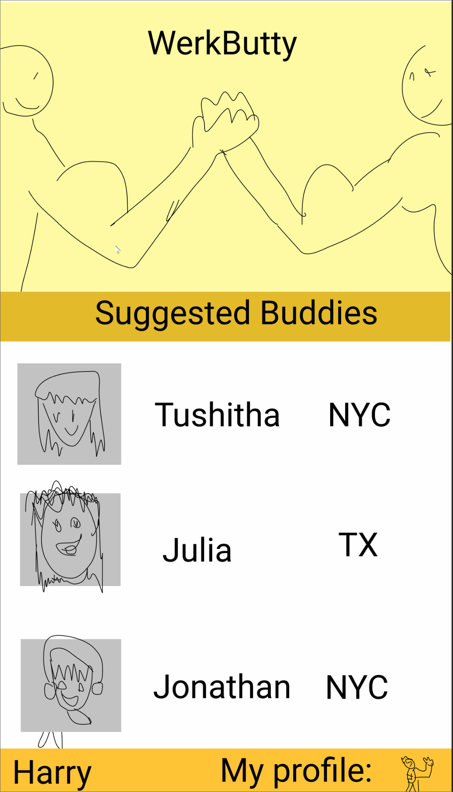

## WerkButty

### App Description
Social media app to find someone to do workouts with in your location.  

### App Idea Evaluation
 - **Category:** Social Networking
 - **Mobile:** Mobile is essential for quickly getting a buddy to workout with.
 - **Story:** Creates a community of people who like to workout with eachother
 - **Market:** Anyone who's lonely and needs a friend
 - **Habit:** Many young students think about working out but always looking for partners to workout with.
 - **Scope:** Directed towards all ages mainly young students and people who do not have a regular workout buddy.
---

## 1. User Stories
**Required Must-have Stories**
 * User can create profile (i.e.- progress)
 * User can login
 * User can add gym memberships
 * User can view other profiles
 * User can contact connected users
 * User can view own profile

**Optional Nice-to-have Stories**
 * User can select specific workouts
 * Leaderboard displaying progress
 * User can see local gym locations and users who go there

## 2. Screen Archetypes
 * Login
   * User can login
 * Register
   * User can register to create an account
 * Stream/Home
   * User can view other profiles
 * Detail
   * User can contact connected users
 * Profile
   * User can view own profile
 * Creation
   * Edit profile
   * Add memberships

## 3. Navigation
**Tab Navigation** (Tab to Screen)
 * Stream/Home
   * Profile Detail
 * Profile
   * User can view own profile

**Flow Navigation** (Screen to Screen)
 * Login
   * Stream
 * Register
   * Stream
 * Stream/Home
   * Profile Detail
 * Detail
   * Messaging
 * Profile
   * Edit profile
   * Add memberships

---

### Wireframes

---

### App Pitch Presentation
// TODO: Add link to Pitch Presentation Deck
